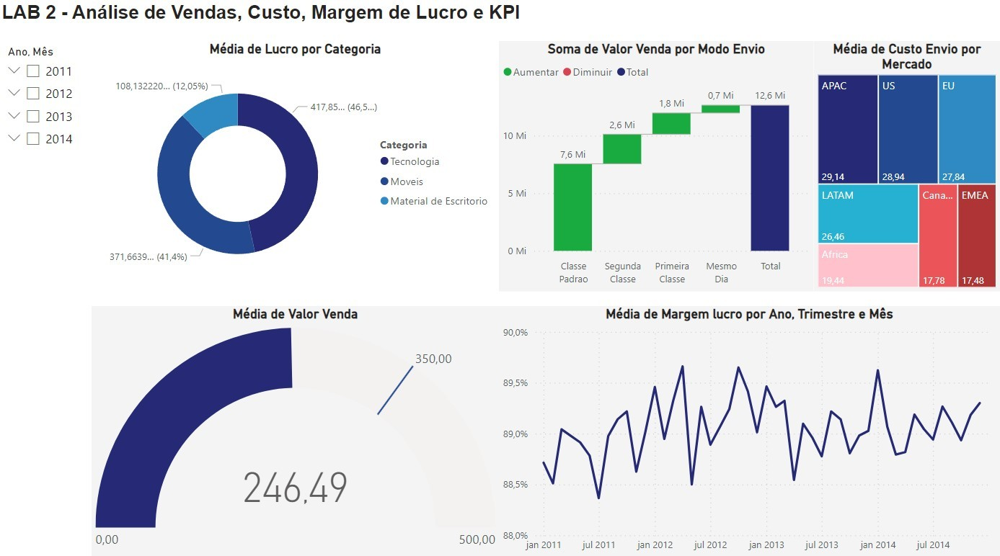

# Analise de Vendas Custo Margem de Lucro e KPI

Olá, pessoal! Hoje eu quero compartilhar com vocês um dashboard que eu fiz sobre alguns indicadores importantes para qualquer negócio: vendas, custo, margem de lucro e KPI.

Vendas são a principal fonte de receita de uma empresa, e por isso é fundamental acompanhar o seu desempenho. Como disse Peter Drucker:
"O que pode ser medido pode ser melhorado."
Uma análise de dados sobre as vendas pode revelar quais são os produtos mais vendidos, quais são os mercados mais lucrativos, quais são as tendências e sazonalidades, entre outras informações valiosas.

Custo é o valor que a empresa gasta para produzir ou adquirir os seus produtos ou serviços. É importante controlar o custo para garantir a rentabilidade e a competitividade da empresa. 
Robert Kaplan: "A informação de custos é essencial para a tomada de decisões estratégicas."
Uma análise de dados sobre o custo pode mostrar quais são os fatores que influenciam o seu aumento ou redução, quais são as oportunidades de economia ou otimização, quais são os riscos e desafios, entre outras informações relevantes.

Margem de lucro é a diferença entre a receita e o custo de um produto ou serviço. É um indicador que mede a eficiência e a saúde financeira de uma empresa. Segundo Warren Buffett:
"O preço é o que você paga, o valor é o que você recebe."
Uma análise de dados sobre a margem de lucro pode indicar quais são os produtos ou serviços mais rentáveis, quais são as estratégias de precificação mais adequadas, quais são os pontos de equilíbrio e alavancagem, entre outras informações cruciais.

KPI é a sigla em inglês para Key Performance Indicator, ou Indicador-chave de Desempenho. São métricas que permitem avaliar o progresso e o resultado de uma empresa em relação aos seus objetivos e metas. 
Albert Einstein: "Não se pode gerenciar o que não se pode medir."
Uma análise de dados sobre os KPIs pode ajudar a definir e monitorar as metas, identificar e corrigir problemas, melhorar processos e práticas, entre outras informações úteis.

Essa análise de dados que eu fiz é baseada em três categorias de produtos: 
Tecnologia;
Móveis;
Material de escritório.

A categoria que teve a maior média de valor de venda foi a tecnologia, seguida pelos móveis e pelo material de escritório. Isso mostra que há uma demanda maior por produtos tecnológicos, que geralmente têm um valor agregado maior.
Foi realizado uma média da margem de lucro ao longo do tempo, para ver como ela se comportou em diferentes períodos. Isso é importante para avaliar se a empresa está mantendo ou aumentando a sua rentabilidade ao longo do tempo, e se há algum fator externo ou interno que afeta a sua margem. Segundo Porter (1985):

"A análise da margem de lucro ao tempo permite identificar as forças competitivas que atuam sobre a empresa e as suas vantagens competitivas."
Os mercados clientes que eu analisei foram: África, APAC (Ásia-Pacífico), Canadá, EMEA (Europa, Oriente Médio e África), EU (União Europeia), LATAM (América Latina) e US (Estados Unidos). Os mercados que apresentaram a maior média de custo de envio foram:
APAC;
US;
EU.

Isso pode ser explicado pela distância geográfica entre o local de origem e destino dos produtos, pelo tipo de transporte utilizado, pelo volume e peso dos produtos, entre outros fatores. Segundo Chopra e Meindl (2011):
"A análise do custo de envio permite avaliar as alternativas logísticas disponíveis e escolher a mais adequada para cada mercado."
A base de dados utilizada foi disponibilizada pelo curso gratuito do Data Science Academy, com o nome de Microsoft Power BI Para Business Intelligence e Data Science.
O resultado foi o seguinte dashboard:

# Conclusão
Eu gostaria de dizer que essa análise de dados foi muito enriquecedora para mim, pois me permitiu conhecer melhor o negócio e os seus desafios. Eu acredito que esse tipo de análise é essencial para qualquer empresa que queira se destacar no mercado e tomar decisões mais assertivas. 
Se você quer aprender mais sobre como usar o Power BI para business intelligence e data science, recomendo que você faça o curso gratuito do Data Science Academy, com o nome de Microsoft Power BI Para Business Intelligence e Data Science. Nesse curso, você vai aprender desde os conceitos básicos até as técnicas avançadas do Power BI, com exemplos práticos e exercícios.
Espero que este artigo tenha sido útil para você.